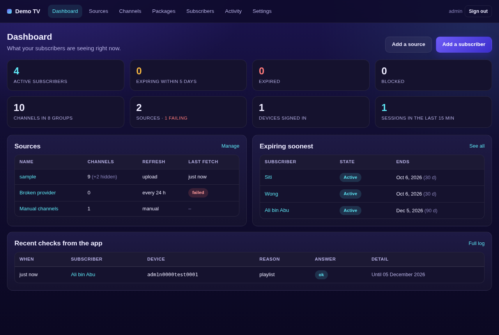

# IPTV Provider System

A self-contained panel for anyone who supplies M3U playlists to subscribers.
Import your upstream playlists, hand every customer their own link, and let
the [IPTV Room](https://iptvroom.nax.my) app enforce expiry and device limits
on the television through the `#UNLOOP-AUTH` line documented at
[iptvroom.nax.my/docs#authorisation](https://iptvroom.nax.my/docs#authorisation).

One Python process. One SQLite file. Nothing else to install or run.



## What it does

**Sources** - upstream playlists, by URL or by file upload.

- Add a URL and it is fetched at once; set it to refresh itself every N hours.
- Add the same URL again and the source is *replaced*, never duplicated.
- Upload several `.m3u` files at once - each becomes a source.
- A refresh replaces every channel of that source, and your own edits and
  deletions are kept and re-applied on top, so a channel you renamed or
  removed stays that way after the provider updates their list.
- Everything in the file survives the round trip: `#EXTVLCOPT`, `#KODIPROP`
  (ClearKey / Widevine keys), `#EXTHTTP`, `#EXTGRP`, `|header` suffixes,
  `url-tvg` guides, `type="series"` attributes and the rest.

**Channels** - one list across every source, or one source at a time.

- Filter by source, by group, by deleted/visible; search by name, URL,
  `tvg-id` or group; 50 to 500 per page.
- Edit any channel inline: name, group, `tvg-id`, logo, URL, duration and
  its directive lines.
- Select a page, or *every channel matching the filter*, and delete or
  restore in one go. Deleted channels from a fetched source are tombstoned so
  they do not return on the next refresh; you can restore them any time.
- Add channels by hand into the built-in Manual source.

**Packages** - optional tiers: a set of sources (and optionally groups) that
a subscriber may see. No package means everything.

**Subscribers** - your customers. There is no sign-up; you add them.

- One click creates a subscriber with a unique playlist link:
  `https://your-panel/p/<token>.m3u`.
- Expiry date (or never), device limit, package, contact, private note.
- The **four states** the app understands, from the customer's point of view:

  | State | When | What the television shows |
  |---|---|---|
  | `ok` | Active, not expiring soon | Nothing - plays normally |
  | `warn` | Within *N* days of expiry, or you set a warning | Your message in a dismissable bar |
  | `block` | You blocked them, or the device limit is hit | Playback stops; your message and a QR code fill the screen |
  | `expired` | Expiry date has passed | Same as block, headed as a subscription problem |

- Devices are tracked per subscriber - the first *N* keep their slots. Remove
  one from the panel, or let the customer do it from the self-service page
  (`/me/<token>`) that the app shows as a QR code when the limit is hit.
- Bulk actions across a page or across every match: extend, warn, block,
  unblock, delete.
- *Ask /unloop as the app would* sends the exact JSON the app sends and shows
  the reply, so you can see what a customer will get before they do.

**Activity** - every check the app made, with subscriber, device, reason and
the answer given. Pruned automatically.

**Settings** - public address, the `#UNLOOP-AUTH` attributes (`poll`,
`grace`, `on-error`), the wording of every message, the renew and support
URLs behind the QR codes, defaults for new subscribers, and an advanced
`stream.headers` block for providers whose CDN checks a token.

## Run it

```bash
git clone https://github.com/afandiazmi/iptv-provider-system.git
cd iptv-provider-system
pip install -r requirements.txt
python app.py
```

Open http://localhost:8302, create the admin account, add a source, add a
subscriber, copy their link. That is the whole setup.

Data lives in `./data/` (`provider.db` plus a copy of each imported playlist).
Back that folder up and you have backed up everything.

### Docker

```bash
docker build -t iptv-provider .
docker run -d --name iptv-provider -p 8302:8302 -v iptv-data:/app/data iptv-provider
```

### Environment variables

| Variable | Default | Meaning |
|---|---|---|
| `IPTV_PORT` | `8302` | Port to listen on |
| `IPTV_HOST` | `0.0.0.0` | Interface to bind |
| `IPTV_DATA_DIR` | `./data` | Where the database and playlist copies live |
| `IPTV_MAX_PLAYLIST_MB` | `64` | Largest playlist accepted, upload or URL |
| `IPTV_FETCH_TIMEOUT` | `60` | Seconds to wait for an upstream fetch |
| `IPTV_SCHEDULER_TICK` | `60` | How often the auto-refresh scheduler wakes |
| `IPTV_ACTIVITY_KEEP_ROWS` | `20000` | Activity log rows kept |
| `IPTV_PAGE_SIZE` | `50` | Default rows per page |
| `IPTV_DEBUG` | unset | `1` runs Flask's debug server instead of waitress |

## Put it behind HTTPS - this part is not optional

The IPTV Room app **ignores** an `#UNLOOP-AUTH` line whose endpoint is plain
`http`, and it refuses a playlist fetched over plain `http` from carrying one
at all. Both are deliberate: a line that names where to send a device
identifier must be one only you could have written. Until the panel is
served over `https`, subscribers can watch but nothing is enforced.

The panel itself speaks plain HTTP on port 8302; put a TLS proxy in front.
The shortest way is [Caddy](https://caddyserver.com/), which fetches and
renews certificates by itself. `Caddyfile` in this repository is all of it:

```
panel.example.com {
    reverse_proxy 127.0.0.1:8302
}
```

Then set **Settings -> Public address** to `https://panel.example.com`. Every
playlist link and the authorisation line are built from that value.

Cloudflare Tunnel, nginx with certbot, or any host that terminates TLS for
you works the same way. Forward `X-Forwarded-For` if you want real IPs in
the activity log.

## How the app talks to this panel

Every playlist the panel serves starts with:

```
#EXTM3U name="My IPTV" url-tvg="https://guide.example.com/epg.xml"
#UNLOOP-AUTH:1 url="https://panel.example.com/unloop" token="<subscriber token>" poll="300" grace="3600" on-error="allow"
```

The app then `POST`s JSON to `/unloop` when the list is loaded, on the way
into a channel, and every `poll` seconds while playing:

```json
{ "v": 1, "app": "IPTVRoom", "app_version": "1.0.0", "os": "Linux;Android 16",
  "device_id": "d70ff1974ff64351", "device_stable": true,
  "session_id": "9f3c1a70b5d2e846", "reason": "playlist",
  "token": "<subscriber token>" }
```

and the panel answers, always with `200` and `application/json`:

```json
{ "v": 1, "state": "warn", "message": "Your subscription ends in 3 day(s).",
  "action_url": "https://panel.example.com/me/<token>", "action_label": "Scan to renew",
  "recheck": 300, "device": { "registered": true, "slot": 1, "limit": 2 },
  "channels": { "blocked": [] } }
```

A body sent without `Content-Type: application/json` is still read. A
subscriber the panel does not know gets `block`, never an HTTP error - the app
reads any non-200 as "unreachable" and keeps playing, which is not what a
refusal should do.

Other players ignore the `#UNLOOP-AUTH` line as a comment and simply play
the list. If you need a refusal to hold for those too, set **Blocked or
expired subscribers get: an empty playlist** (the default) - or, for real
enforcement, gate your stream URLs on a token and issue it through
**Settings -> Advanced: stream headers**.

## Public endpoints

| Method | Path | Purpose |
|---|---|---|
| `GET` | `/p/<token>.m3u` (also `/p/<token>`, `/playlist/<token>`) | The subscriber's playlist |
| `POST` | `/unloop` | The authorisation endpoint the app calls |
| `GET`/`POST` | `/me/<token>` | Subscriber self-service: status and devices |
| `GET` | `/healthz` | `{"ok": true}` for monitoring |

Everything else requires an admin session.

## Tests

```bash
python -m unittest discover -s tests -v
```

## Project layout

```
app.py                     entry point - python app.py
iptvprovider/
  config.py                environment variables
  db.py                    SQLite schema, connections, settings
  m3u.py                   playlist parser and writer
  fetcher.py               fetching upstream playlists, with limits
  library.py               sources, channels, overrides, refresh
  subscribers.py           subscribers, devices, the four states
  playlist.py              building a subscriber's playlist (cached per package)
  verdict.py               the /unloop answer
  scheduler.py             background auto-refresh thread
  auth.py                  admin passwords (scrypt) and login throttling
  web.py                   the Flask application and every route
  templates/, static/      the admin panel
tests/                     unit tests (standard library unittest)
examples/sample.m3u        a playlist to try with
```

## Licence

MIT - see `LICENSE`.
